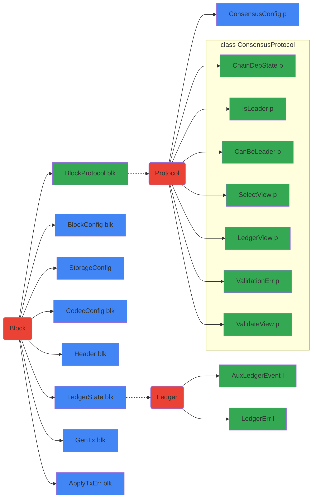

# Abstract Protocol

## Tutorials

### Overview

- [Ouroboros.Consensus.Tutorial.Simple](../src-docs/Ouroboros/Consensus/Tutorial/Simple.lhs):
  Simple round-robin instantiation of the abstract Ouroboros consensus protocol.
- [Ouroboros.Consensus.Tutorial.WithEpoch](../src-docs/Ouroboros/Consensus/Tutorial/WithEpoch.lhs):
  Example in which the leader schedule depends on data from the chain.

### Generating documents

From the `ouroboros-consensus` directory, run for your choice of `<output
file>`:

    pandoc -s -f markdown+lhs src-docs/Ouroboros/Consensus/Tutorial/Simple.lhs -o <output file>

## Overview

The following diagram depicts the relation between various constructs in the
abstract specification of the protocol and the consensus-level view of th
ledger.
- Red boxes indicate concepts, or informal kinds (e.g., `ShelleyLedgerState`
  would have the informal kind `Ledger`).
- Blue boxes indicate data families.
- Green boxes indicate type families.
- Type or data families map the block attached to the incoming arrow to the
  block attached to the outgoing arrow. When there is no outgoing arrow, the
  family maps to any type (e.g., `BlockConfig blk`).

